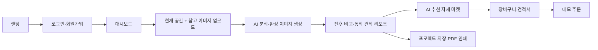
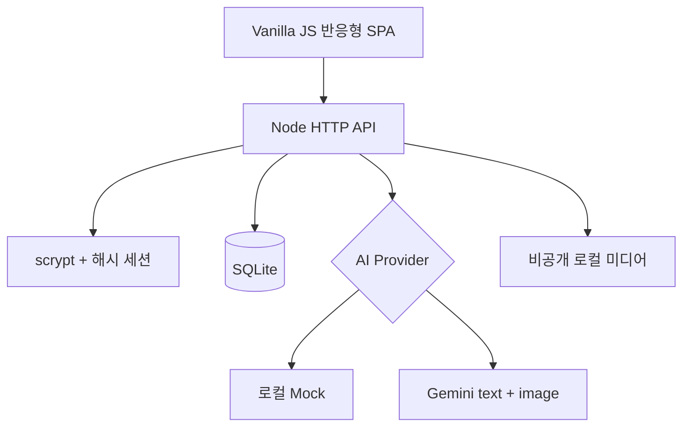

# 모인 제품·개발 설계

## 분석 기준

작업 폴더의 PDF 5개와 PNG 23개를 전부 확인했습니다. PDF 중 `moin_prd_specification.pdf`, `(1)`, `(2)`는 동일 내용이고, `moin_prd_specification_final (로그인포함 최종).pdf`는 로그인까지 포함한 최신 기능 명세입니다. `PRD 명세서 작성.pdf`는 7페이지 와이어(마지막 페이지 공백)여서 화면 구성의 최우선 기준으로 사용했습니다. PNG는 해시 기준 12개 고유 화면이며 랜딩, 로그인, 대시보드, 업로드, 리포트, 마켓의 모바일·데스크톱 상태를 교차 확인했습니다.

세부 PDF 추출물, 페이지 렌더와 중복 판정은 `tmp/pdfs/`에 있습니다.

## 제품 흐름



보호 경로는 인증 세션이 없으면 `/login`으로 이동합니다. 프로젝트 원본과 결과 이미지는 정적 공개 경로가 아니라 소유권을 확인하는 API로 제공합니다.

## 화면 설계 원칙

- 기본 강조 토큰은 메인 영상에서 추출한 테라코타 `#A86030` 한 가지 색상만 사용하며 100%, 80%, 60%, 36%, 20%, 12%, 8%, 5% 투명도 단계로 구분
- 브랜드 로고는 미드센추리 원목색 `#8C6239`, 화면과 카드 배경은 순수 화이트 `#FFFFFF`, 본문은 다크 그레이를 사용
- 랜딩 Start CTA는 밝은 반투명 캡슐 위에 `Start`와 `무료 체험 시작하기`를 2단으로 표시하고, 테라코타 `#A86030`은 원형 화살표와 서비스 전반의 단일 포인트색으로 사용
- 영문·한글·숫자·문장부호 모두 로컬 `SUIT-Variable.woff2`를 사용하며 장식용 가로선은 표시하지 않음
- 랜딩 메인 비주얼은 `moin-main.mp4`를 음소거 자동재생·반복 배경으로 사용하고 기존 스케치를 포스터 및 모션 감소 환경의 대체 이미지로 유지
- 서체: 전역 SUIT Variable → 시스템 sans-serif. 메인 카피는 가벼운 키커와 중간 굵기 타이틀의 편집 디자인식 위계를 사용
- 데스크톱: 상단 글로벌 내비게이션, 넓은 2열/4열 정보 구조
- 모바일: 390px 기준 전용 헤더, 카드 2열, 고정 하단 내비게이션과 마켓 행동 바
- 내비게이션: Home·브랜드 로고는 `/dashboard`로 이동하고, 동일 경로를 다시 눌러도 방문 기록을 중복 생성하지 않음. 내부 뒤로가기는 실제 직전 Moin 화면으로 이동하며 앱 이력이 없으면 홈으로 복귀
- 업로드: 데스크톱 중앙 모달, 모바일 바텀시트 형태
- 리포트: 전후 비교 슬라이더, AI 분석 요약, 견적 표, 반원 게이지
- 견적서: 장바구니 선택 자재를 우선 반영하고 최신 AI 견적, 표준 예시 순으로 보완해 항상 문서형 상세 견적을 표시. 견적 번호·발행일·유효기간·항목별 금액·총합과 A4 PDF 인쇄 제공
- 마켓: 와이어의 벽지·바닥재·타일·도구 퀵 카테고리, 8개 카드, 추천 우선 정렬과 배지
- 접근성: 키보드 포커스 표시, 모달 초기 포커스·Tab trap·Esc 닫기·호출 버튼 복귀, 대화상자 이름과 버튼 레이블

브라우저 외곽 프레임과 휴대폰 목업 외곽은 서비스 UI가 아니므로 구현 대상에서 제외했습니다.

## 런타임 구조



외부 런타임 의존성을 두지 않았고 Node 24의 `node:sqlite`를 사용합니다. 금액은 모두 원 단위 정수입니다. DB에는 사용자, 세션, 프로젝트, 자재, 장바구니, 주문, 주문 항목을 저장합니다.

## AI 계약

기본 `mock` 공급자는 키 없이 전체 흐름을 재현합니다. `gemini` 모드는 키·텍스트 모델·이미지 모델이 모두 있어야 서버가 시작됩니다.

텍스트 결과 계약:

- `summary`: 공간 비교 요약
- `style`: 추천 스타일
- `palette`: 최대 3개 색상
- `recommendedSlugs`: 서버 allowlist 안의 최대 5개 상품
- `estimate`: 화면에서 직접 렌더링할 자재비·공구비·인건비·합계·절감액

이미지 결과는 PNG/JPEG/WebP와 8MB 제한을 다시 검증해 저장합니다. timeout과 429/5xx 제한 재시도를 적용합니다.

### AI 인테리어 인페인팅 시스템 명세

Moin의 이미지 생성 엔진은 `src/services/ai.js`의 `MOIN_INTERIOR_INPAINTING_SYSTEM_PROMPT(v1)`를 Gemini `systemInstruction`으로 전달한다. 이 프롬프트는 일반적인 스타일 복사가 아니라, 공간 뼈대 위에 자재를 정밀 합성하는 구조 보존형 인페인팅 계약이다. 현재 3장 모드는 바닥·벽 고정형 자재 전사이며, `spaceImage`는 카메라·원근·배치의 구조 기준일 뿐 세그멘테이션 결과나 객체 선택 마스크가 아니다.

#### 생성 API와 입력 계약

- POST /api/v1/generate는 로그인 사용자의 3장 인페인팅 요청을 처리한다.
- floorMaterialImage: Input 1. 바닥재 텍스처·색상·패턴 스와치이며, 가시 바닥 영역에만 적용한다.
- wallMaterialImage: Input 2. 벽지 텍스처·색상·패턴 스와치이며, 가시 벽면에만 적용한다.
- spaceImage: Input 3. 공간 사진 또는 스케치로서 절대적인 구조 뼈대다.
- 각 이미지는 PNG, JPEG, WebP만 허용하고 장당 최대 8MiB다. 3장의 Base64 요청을 수용하기 위해 요청 본문 한도는 36MiB다.
- 생성이 끝나면 기존 프로젝트와 동일하게 리포트 경로와 프로젝트 데이터를 반환한다. 공간 뼈대·바닥재·벽지 원본은 사용자 소유의 비공개 미디어로 저장하며, 프로젝트 삭제 시 참조가 남지 않은 파일도 함께 정리한다.
- 기존 POST /api/v1/projects/analyze의 2장 흐름은 그대로 유지한다. 이 호환 모드에서는 현재 공간 사진을 구조 뼈대로, 참고 이미지를 재질·색상·조명 전용 레퍼런스로 해석한다.
- 현재 로컬 `mock` 공급자는 세그멘테이션이나 실제 재질 합성을 수행하지 않고, 구조 뼈대 이미지를 `previewOnly` 미리보기로 반환한다. Gemini 공급자는 프롬프트 기반 생성을 수행하지만, 현재 로컬 구성에는 SAM 또는 자동 객체 분할 런타임이 번들되어 있지 않다.

#### 고정 시스템 지시문

역할은 고해상도 건축 인페인팅 및 자재 전사에 특화된 전문 인테리어 이미지 합성 엔진이다. 다음 규칙은 요청 문구보다 우선한다.

1. 구조 충실도(Structural Fidelity)
   - Input 3의 카메라 앵글, 렌즈 인상, 원근, 크롭, 창문·문·벽·빌트인 위치, 가구와 소품의 종류·배치·크기·가림 순서를 절대 변경하지 않는다.
   - 물체를 추가·삭제·이동·회전·확대·축소·교체·재배치하지 않는다. 스케치의 선과 실루엣은 사진 품질의 재질로만 복원한다.

2. 자재 정밀 매핑(Direct Material Application)
   - Input 1의 결·색·패턴·반사율은 바닥에만, Input 2의 결·색·패턴·마감은 벽에만 적용한다.
   - 패턴의 방향, 반복 크기, 원근 축소를 UV 매핑과 유사한 방식으로 보정한다. 바닥재와 벽지의 적용 영역을 서로 섞지 않는다.

3. 현실적 조명 합성(Realistic Lighting Integration)
   - 공간 뼈대 안의 창문과 광원 위치를 읽고 기존의 빛 방향을 유지한다.
   - 새 자재 위에 자연광, 부드러운 하이라이트, 접지 그림자, 반사광, 주변광을 물리적으로 자연스럽게 합성한다.

4. 오브젝트 재질 복원(Object Re-texturing)
   - 소파·테이블·조명·액자·소품의 형태와 배치는 잠근 채, 패브릭·원목·유리·금속 등 현실적인 사진 재질감으로 복원한다.
   - 결과는 스케치·콜라주·무드보드가 아닌, Input 3과 같은 프레임의 완성된 고해상도 인테리어 사진 1장이다.

5. 엄격한 제외 규칙
   - 사용자가 요청하지 않은 가구나 소품을 만들지 않는다.
   - 분할 화면, 테두리, 캡션, 라벨, 텍스트, 로고, 워터마크, DIY 가치 게이지, 대시보드 또는 UI 요소를 생성 이미지에 포함하지 않는다.

시스템은 생성 결과의 analysis_json에 프롬프트 버전, 입력 모드(floor-wall-space 또는 space-reference), 구조 잠금 여부를 기록해 이후 리포트와 재현 검토에 사용한다.

#### 객체 단위 인페인팅(Object-aware Inpainting) 확장 명세

이 확장은 벽·바닥 고정형 전사와 별개로, 사용자가 소파·테이블·커튼·벽·바닥 등 이미지 안의 특정 객체 또는 영역에만 자재를 적용하는 기능이다. 객체명(`소파` 등)만으로는 이미지 안의 정확한 좌표와 경계를 알 수 없으므로, 객체 단위 요청은 반드시 이미지 크기에 정렬된 마스크를 기준으로 한다.

##### 현재 기준: 수동 조절 마스크

- 초기 제공 기준은 자동 분할이 아닌 **수동 조절 마스크**다. 사용자는 원본 공간 이미지 위에서 객체를 클릭하거나 브러시·지우개로 선택 영역을 조절하고, 최종 선택을 PNG 마스크로 확정한다.
- `maskImage`는 단일 채널 또는 알파를 가진 PNG여야 한다. 흰색 또는 불투명 픽셀은 편집 대상이고, 검정 또는 완전 투명 픽셀은 보존 대상이다.
- 마스크는 EXIF 방향을 보정한 `sourceImage`와 픽셀 가로·세로가 정확히 같아야 한다. 서버는 PNG 형식, 이미지 크기, 대상 객체명, 요청 사용자 소유권을 검증한다. 실제 흑백 마스크 생성과 선택 영역 검증은 현재 브라우저의 수동 선택 도구가 담당한다.
- `targetObject`는 리포트와 감사 기록을 위한 객체 ID·표시명이다. 경계를 결정하는 근거는 `targetObject` 문자열이 아니라 `maskImage`다.

##### 객체 단위 생성 API 계약

`POST /api/v1/generate/object-material`은 수동 마스크 기반 객체 단위 생성의 확장 API 계약이며, 활성화 시 다음 요청 형식을 따른다.

```json
{
  "sourceImage": "data:image/jpeg;base64,...",
  "materialImage": "data:image/webp;base64,...",
  "maskImage": "data:image/png;base64,...",
  "targetObject": "소파"
}
```

- `sourceImage`(Input A): 절대적인 공간 뼈대다. 카메라, 원근, 크롭, 건축 구조, 가구·소품의 위치와 가림 순서를 기준으로 사용한다.
- `maskImage`(Input B): 정확히 하나의 편집 대상 영역을 정의하는 PNG 이진 마스크다. 대상 밖의 영역은 생성 대상이 아니다.
- `materialImage`(Input C): 대상 영역에 전사할 재질·색상·패턴·광택의 스와치 또는 레퍼런스다.
- `targetObject`는 결과 메타데이터에 저장하는 1~80자 객체 표시명이다. 실제 편집 경계는 임의의 객체명 문자열이 아니라 `maskImage`로만 결정한다.
- 세 이미지의 형식·크기 제한은 기존 생성 API 정책을 따른다. 단, `maskImage`는 PNG만 허용한다. 원본·자재·마스크와 생성 결과는 사용자 소유의 비공개 미디어로 저장하고 프로젝트 삭제 시 참조 여부를 확인해 정리한다.

##### 객체 단위 시스템 지시문

```text
Role: Advanced Neural Texturing & Object Inpainting Engine.

Input A is the source space image and the absolute structural skeleton.
Input B is a binary target mask: white or opaque pixels are the only editable region; black or transparent pixels are preservation-only.
Input C is the material swatch to transfer.

Apply Input C's colour, texture, pattern, scale, reflectance, and material character only inside Input B. Preserve Input A's camera, perspective, crop, architecture, object silhouette, occlusion, lighting direction, and object placement. Infer physically plausible highlights, contact shadows, folds, curvature, and surface response only for the selected object.

Do not add, remove, move, resize, replace, or restyle any object. Do not generate split screens, captions, labels, text, logos, watermarks, gauges, dashboards, or UI. Return one full-frame photorealistic result aligned to Input A.
```

##### 운영 환경의 하드 마스크 합성 요구사항

프롬프트 준수만으로는 마스크 밖 픽셀 보존을 증명할 수 없다. 운영 환경에서는 생성 모델의 전체 프레임 결과를 그대로 저장하지 않고, 서버가 `maskImage`를 하드 마스크로 사용해 최종 이미지를 합성해야 한다.

```text
finalPixel = generatedPixel  (maskImage가 편집 대상인 경우)
finalPixel = sourcePixel     (maskImage가 보존 대상인 경우)
```

따라서 마스크 밖의 모든 픽셀은 원본과 동일하게 유지된다. 경계 보정이 필요하면 마스크 바깥을 임의로 feathering하지 않고, 사용자가 확인한 확장 마스크를 새 버전으로 저장한 뒤 그 범위 안에서만 수정한다. 결과 메타데이터에는 `generationMode`, `targetObject`, `maskPath`, `maskVersion`, `maskCoverage`, `promptVersion`, `imageModel`, `compositingMode: hard-mask`를 기록한다.

##### 향후 자동 세그멘테이션(SAM) 연동 — 현재 미포함

SAM 또는 동등한 세그멘테이션 런타임은 현재 Node/SQLite 로컬 구성에 번들되어 있지 않다. 향후에는 `SegmentationAdapter`를 통해 원본 이미지에서 객체 후보와 마스크를 생성하고, 사용자가 후보를 선택·보정한 뒤 동일한 `maskImage` 계약으로 객체 단위 생성 API를 호출한다.

권장 흐름은 `POST /api/v1/segmentations`에서 사용자 소유의 `segmentationId`와 객체별 `targetObjectId`, `label`, `bounds`, `confidence`, 비공개 마스크 미리보기를 반환한 다음, `POST /api/v1/generate/object-material`이 `segmentationId`와 `targetObjectId`로 저장된 마스크를 해석하는 방식이다. 이때 `targetObject`에는 사용자에게 보이는 `label`을 기록한다. 자동 세그멘테이션은 수동 마스크를 대체하는 것이 아니라, 사용자가 보정·확정할 수 있는 선택 후보를 제공하는 역할이다.

### 버전 이력·롤백 아키텍처 (구현됨)

생성 모델은 프로젝트의 기억 저장소가 아니다. SQLite의 `project_versions`가 원본과 생성·롤백 결과를 스냅샷으로 보관한다. 별도의 `active_version_id` 컬럼은 두지 않으며, 가장 최근 `completed` 스냅샷을 활성 버전으로 계산한다. `projects` 행은 그 최신 완료 버전의 화면 표시용 투영값이다. 따라서 “이전 스케치로 롤백”은 AI에게 이미지를 지우라고 요청하는 것이 아니라, 원본 또는 선택한 스냅샷을 반영하는 새 `rollback` 버전을 추가하는 비파괴 상태 변경이다.

- `GET /api/v1/projects/:projectId/versions`: 소유자에게 `baselineVersionId`, 계산된 `activeVersionId`, 순번·부모 관계·상태·입력 요약을 가진 버전 목록을 반환한다. 비공개 파일 경로나 원본 Base64는 반환하지 않는다.
- `POST /api/v1/projects/:projectId/versions/analyze`: 불변 프로젝트 원본에서 새 `generation` 버전을 만든다. 본문은 `referenceImage` 하나 또는 `floorMaterialImage`와 `wallMaterialImage` 쌍을 받는다. 기존 결과를 다음 생성의 구조 입력으로 사용하지 않는다.
- `POST /api/v1/projects/:projectId/rollback`: 선택적으로 `{ "versionId": "..." }`를 받아 해당 완료 스냅샷을 복원한다. 값을 생략하면 원본 `baseline`으로 돌아간다. 서버는 프로젝트 투영값을 갱신하고 새 `rollback` 버전을 추가하며, 이미지 생성·기존 파일 덮어쓰기·삭제는 수행하지 않는다.

버전에는 부모 ID, 원본·결과·자재·마스크의 비공개 경로와 프롬프트·분석 메타데이터를 저장하고, 모든 조회·롤백에서 프로젝트 소유권을 확인한다. 객체 단위 결과의 마스크 밖 픽셀 보존을 완전히 보장하려면 향후 운영 환경에서 서버 하드 마스크 합성을 적용한다.

전체 [1번 질문] 기준 명세는 `docs/QUESTION_01_VERSIONED_INPAINTING.md`에 보관한다.

## Supabase 전환 설계

현재 SQL은 `database.js`의 스키마뿐 아니라 `server.js` 핸들러에도 있으므로 다음 순서로 이전합니다.

1. 사용자, 프로젝트, 카트, 주문별 async repository 인터페이스 분리
2. 현재 SQLite 쿼리를 repository 구현으로 이동하고 회귀 테스트 유지
3. Supabase Auth와 Postgres/RLS 구현 추가
4. 로컬 미디어를 비공개 Storage 버킷과 signed URL로 교체
5. Service Role 키는 서버에만 두고 브라우저에는 anon 키와 RLS만 허용

## 검증 결과

- Node 자동 테스트 35개 통과
- 원본 기준 재생성, 선택 버전/원본 롤백 스냅샷 추가, 최신 완료 버전 활성화, 버전 미디어 삭제를 자동 검증
- 객체 단위 생성의 A/B/C 입력 순서, PNG 마스크·원본 해상도 일치, 객체 자재·마스크 개인 미디어 보관과 삭제를 자동 검증
- 8MiB 이미지 두 장 분석과 바닥재·벽지·공간 뼈대 3장 인페인팅 요청 성공, 36MiB 초과 JSON은 구조화된 413
- 데스크톱 1440×900, 모바일 390×844의 12개 핵심 화면 가로 오버플로 없음
- 실제 Chrome E2E에서 콘솔·페이지 오류와 이미지 로드 실패 없음
- 검색/가격/카테고리 조합 복원, 추천 상품 우선 정렬, 장바구니 중복 방지, 수량 변경, 계정 간 상태 초기화 확인
- 모달 opacity·스크롤 잠금·포커스 trap/복귀 확인

## 운영 전 남은 외부 연동

로컬 MVP 밖의 항목은 실제 Gemini/Nano Banana 모델 선택과 키, Supabase, OAuth, 결제사, 이메일 인증, 알림입니다. 공개 Gemini 서비스 전에는 현재 사용자별 메모리 제한을 Redis/게이트웨이 기반 IP·계정·전역 예산 제한으로 교체하고, 업로드 삭제·보존 기간과 악성 파일 검사 정책을 확정해야 합니다.
